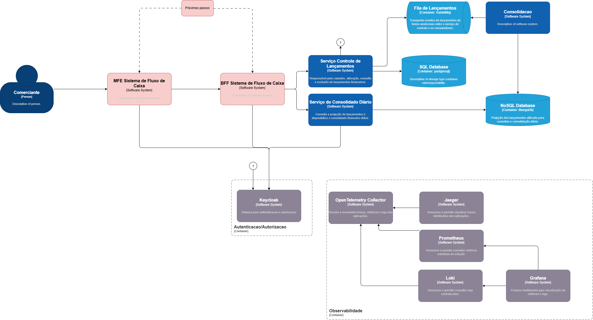

# Desafio de Arquitetura - Microservices

## Objetivo

Esta solução implementa uma arquitetura de microserviços para controle de lançamentos financeiros e consolidação diária do fluxo de caixa.

A solução foi construída considerando:

- separação de capacidades de negócio;
- independência entre os serviços;
- persistência adequada a cada contexto;
- comunicação assíncrona;
- resiliência;
- idempotência;
- segurança;
- observabilidade;
- testes automatizados;
- escalabilidade;
- documentação das decisões arquiteturais.

A arquitetura também contempla uma jornada de experiência composta por Micro Frontend e BFF, representada na arquitetura alvo, enquanto a implementação atual está concentrada nos serviços de backend e infraestrutura necessários para demonstrar o cenário proposto.

---

## 1. Pré-requisitos

Para executar a solução localmente, tenha instalado:

- .NET 9 SDK;
- Docker;
- Docker Compose;
- Postman para os testes funcionais;
- k6 para executar o teste de carga de 50 requisições por segundo.

A execução principal da solução utiliza Docker Compose.

---

## 2. Estrutura da solução

Os principais componentes são:

- MicroService.ControleLancamentos;
- MicroService.ConsolidadoDiario;
- Consumer.ConsolidadoDiario;
- PostgreSQL;
- MongoDB;
- RabbitMQ;
- Keycloak;
- OpenTelemetry Collector;
- Prometheus;
- Grafana;
- Loki;
- Jaeger.

A estrutura principal do projeto está organizada em:

- src;
- docs;
- README.md.

Os arquivos de infraestrutura, testes de carga, configuração do Keycloak e Postman estão organizados dentro de `src`.

---

## 3. Arquitetura

A arquitetura da solução é representada pelo diagrama C4 abaixo.

O diagrama apresenta os principais atores, a jornada de experiência, serviços, persistências, mensageria, autenticação e componentes de observabilidade.

A documentação detalhada da arquitetura e das decisões técnicas está disponível no diretório `docs`.

[Visualizar o diagrama C4 em tamanho original](docs/c4.drawio.png)

---

## 4. Subindo a solução

Os arquivos Docker Compose estão dentro de `src`.

A partir da raiz do projeto, execute:

    docker compose -f src/docker-compose.yml -f src/docker-compose.observability.yml up --build -d

Esse comando sobe:

- PostgreSQL;
- RabbitMQ;
- MongoDB;
- Keycloak;
- Controle de Lançamentos;
- Consolidado Diário;
- Consumer;
- OpenTelemetry Collector;
- Jaeger;
- Prometheus;
- Grafana;
- Loki.

Para verificar os containers:

    docker compose -f src/docker-compose.yml -f src/docker-compose.observability.yml ps

Para acompanhar os logs:

    docker compose -f src/docker-compose.yml -f src/docker-compose.observability.yml logs -f

Para parar a solução:

    docker compose -f src/docker-compose.yml -f src/docker-compose.observability.yml down

---

## 5. Portas locais

| Componente | Porta | Endpoint |
| --- | ---: | --- |
| Controle de Lançamentos | 5001 | http://localhost:5001 |
| Consolidado Diário | 5002 | http://localhost:5002 |
| Keycloak | 8080 | http://localhost:8080 |
| RabbitMQ Management | 15672 | http://localhost:15672 |
| Prometheus | 9090 | http://localhost:9090 |
| Grafana | 3000 | http://localhost:3000 |
| Jaeger | 16686 | http://localhost:16686 |
| Loki | 3100 | http://localhost:3100 |

As portas acima correspondem à execução utilizando o Docker Compose da solução.

Quando os projetos são executados diretamente pelo .NET, as portas podem variar conforme a configuração local de execução.

---

## 6. Keycloak

O Keycloak é utilizado para autenticação e autorização baseada em JWT.

O realm utilizado é:

    desafio-microservices

Os clients utilizados são:

- controle-lancamentos;
- consolidado-diario.

As roles utilizadas são:

- lancamentos.read;
- lancamentos.write;
- consolidado.read;
- consolidado.write.

O realm está versionado em:

    src/keycloak/realm/desafio-microservices-realm.json

O Docker Compose utiliza a importação automática do realm.

Dessa forma, ao iniciar uma instalação limpa do Keycloak, o realm, clients, roles e usuário de teste são importados automaticamente.

Para os testes locais é utilizado o usuário:

    usuario-teste

O fluxo de usuário e senha utilizado pelas collections do Postman é destinado exclusivamente ao ambiente local.

Em ambientes produtivos devem ser utilizados mecanismos apropriados de autenticação, gerenciamento de credenciais e secrets.

---

## 7. Controle de Lançamentos

O serviço de Controle de Lançamentos é responsável pelo cadastro e gerenciamento dos lançamentos financeiros.

Persistência:

    PostgreSQL

Principais operações:

### Health

    GET http://localhost:5001/health

### Criar lançamento

    POST http://localhost:5001/lancamentos

A criação exige o header:

    Idempotency-Key

### Obter lançamento

    GET http://localhost:5001/lancamentos/{id}

### Listar lançamentos

    GET http://localhost:5001/lancamentos

### Atualizar lançamento

    PUT http://localhost:5001/lancamentos/{id}

### Excluir lançamento

    DELETE http://localhost:5001/lancamentos/{id}

### OpenAPI

    GET http://localhost:5001/openapi/v1.json

As operações de criação, alteração e exclusão exigem a permissão:

    lancamentos.write

As operações de consulta exigem:

    lancamentos.read

A criação utiliza idempotência para evitar duplicidade de operações em caso de repetição da mesma requisição.

---

## 8. Consolidado Diário

O Serviço do Consolidado Diário disponibiliza a consolidação financeira diária a partir da projeção dos lançamentos.

Persistência:

    MongoDB

### Health

    GET http://localhost:5002/health

### Obter consolidado

    GET http://localhost:5002/consolidado-diario/{data}

### Gerar consolidado

    POST http://localhost:5002/consolidado-diario/{data}/gerar

### OpenAPI

    GET http://localhost:5002/openapi/v1.json

A consulta exige:

    consolidado.read

A geração exige:

    consolidado.write

---

## 9. Comunicação assíncrona

A comunicação entre o Controle de Lançamentos e a projeção utilizada pelo Consolidado Diário ocorre de forma assíncrona.

O fluxo utiliza:

- Transactional Outbox;
- RabbitMQ;
- eventos de integração;
- Consumer;
- versionamento de eventos;
- retry no processamento.

Os principais eventos são:

- LancamentoCriadoEvent;
- LancamentoAlteradoEvent;
- LancamentoExcluidoEvent.

O Consumer recebe os eventos e mantém a projeção dos lançamentos no MongoDB.

A projeção utiliza controle de versão para evitar que eventos antigos sobrescrevam informações mais recentes.

Exclusões são propagadas para a projeção por meio de soft delete.

O fluxo principal pode ser representado como:

    PostgreSQL → Transactional Outbox → RabbitMQ → Consumer → MongoDB

---

## 10. Postman

As collections estão disponíveis em:

    src/postman/MicroService.ConsolidadoDiario - v1.postman_collection.json

    src/postman/MicroService.ControleLancamentos - v1.postman_collection.json

No Postman:

1. Importe as collections disponíveis em `src/postman`.
2. Execute o fluxo de autenticação utilizando o Keycloak.
3. Execute os endpoints de Controle de Lançamentos.
4. Execute os endpoints de Consolidado Diário.

Os endpoints exigem os respectivos tokens e permissões configurados no Keycloak.

Após a criação de um lançamento, o identificador retornado pode ser utilizado para as operações subsequentes de consulta, alteração e exclusão.

---

## 11. Fluxo funcional recomendado

Para validar o fluxo completo da solução:

1. Login no Controle de Lançamentos.
2. Login no Consolidado Diário.
3. Criar lançamento.
4. Obter lançamento.
5. Atualizar lançamento.
6. Obter lançamento novamente.
7. Obter consolidado diário.
8. Excluir lançamento.
9. Obter consolidado diário novamente.

Esse fluxo permite observar a propagação assíncrona entre:

    PostgreSQL → Transactional Outbox → RabbitMQ → Consumer → MongoDB

Após a exclusão, o lançamento permanece na projeção MongoDB marcado como excluído, não sendo considerado pelo consolidado diário.

---

## 12. Testes automatizados

Na raiz da solução:

    dotnet test

Resultado esperado da suíte atual:

- 19 testes executados;
- 19 testes aprovados;
- 0 falhas.

Os testes estão distribuídos entre:

- MicroService.ControleLancamentos.Test;
- MicroService.ConsolidadoDiario.Test;
- Consumer.ConsolidadoDiario.Test.

A estratégia atual prioriza testes unitários das regras e comportamentos principais.

A solução não possui testes de integração automatizados neste momento.

---

## 13. Teste de carga

O cenário de carga está disponível em:

    src/tests/LoadTest/consolidado-50rps.js

O teste utiliza k6 e executa:

- 50 requisições por segundo;
- durante 60 segundos;
- aproximadamente 3.000 requisições.

Para executar com o k6 instalado localmente:

    k6 run -e K6_TOKEN=SEU_TOKEN src/tests/LoadTest/consolidado-50rps.js

O token deve ser obtido no Keycloak utilizando o client:

    consolidado-diario

O teste utiliza o endpoint:

    GET /consolidado-diario/2026-09-09

Resultado de referência validado durante o desenvolvimento:

- 3.000 requisições;
- aproximadamente 50,03 requisições por segundo;
- 0% de falhas HTTP;
- 100% dos checks com sucesso;
- P95 de aproximadamente 6,54 ms;
- P90 de aproximadamente 5,91 ms;
- tempo médio de aproximadamente 4,81 ms.

Esse resultado atende ao cenário de carga utilizado como referência para a solução.

---

## 14. Observabilidade

A solução utiliza OpenTelemetry como padrão de instrumentação.

Os principais componentes são:

- OpenTelemetry Collector;
- Jaeger;
- Prometheus;
- Grafana;
- Loki.

Para subir a stack completa:

    docker compose -f src/docker-compose.yml -f src/docker-compose.observability.yml up --build -d

Fluxo de observabilidade:

    Aplicações → OpenTelemetry Collector → ferramentas de observabilidade

O Collector recebe sinais via OTLP.

Os sinais são encaminhados para:

- traces → Jaeger;
- métricas → Prometheus;
- logs → Loki.

O Grafana utiliza Prometheus e Loki como fontes de dados para visualização.

Principais interfaces:

- Grafana: http://localhost:3000
- Prometheus: http://localhost:9090
- Jaeger: http://localhost:16686
- Loki: http://localhost:3100

A solução possui observabilidade de requisições HTTP, métricas de runtime, logs e traces distribuídos.

---

## 15. Resiliência

O Controle de Lançamentos não possui dependência síncrona do Serviço do Consolidado Diário.

Portanto, a indisponibilidade do Consolidado Diário não impede:

- criação de lançamentos;
- alteração de lançamentos;
- exclusão de lançamentos;
- persistência no PostgreSQL;
- publicação dos eventos por meio do Outbox.

A comunicação com a projeção ocorre de forma assíncrona por meio do RabbitMQ.

O processamento das mensagens possui política de retry.

Essa arquitetura reduz o acoplamento temporal entre os serviços e permite que o processamento das projeções seja retomado após uma indisponibilidade.

---

## 16. Segurança

A solução utiliza Keycloak para autenticação e autorização.

Os serviços validam tokens JWT e aplicam políticas de autorização baseadas em roles.

Principais permissões:

- lancamentos.read;
- lancamentos.write;
- consolidado.read;
- consolidado.write.

As operações são protegidas de acordo com a capacidade necessária.

A solução também utiliza:

- autenticação baseada em JWT;
- autorização por políticas;
- isolamento de responsabilidades;
- idempotência;
- validação de tokens;
- controle de permissões.

As configurações locais são simplificadas para facilitar a execução do desafio.

Para produção, recomenda-se utilizar gerenciamento seguro de secrets, credenciais específicas por ambiente, HTTPS e políticas de segurança mais restritivas.

---

## 17. Arquitetura

A solução utiliza uma arquitetura baseada em microserviços, com separação das capacidades de negócio.

Principais capacidades:

- Controle de Lançamentos;
- Consolidação Diária.

O Controle de Lançamentos possui PostgreSQL como fonte de dados transacional.

O Consumer mantém uma projeção dos lançamentos no MongoDB.

O Serviço do Consolidado Diário utiliza essa projeção para consultas e consolidação.

RabbitMQ realiza a comunicação assíncrona entre os componentes.

A arquitetura também contempla:

- jornada com Micro Frontend;
- BFF;
- Keycloak;
- OpenTelemetry;
- observabilidade centralizada;
- resiliência;
- idempotência;
- versionamento de eventos;
- Transactional Outbox.

A representação visual da arquitetura está disponível na documentação e no diagrama C4 elaborado para a solução.

---

## 18. Documentação

A documentação arquitetural está organizada em `docs`.

Principais documentos:

- `requisitos.md`
- `dominios-e-capacidades.md`
- `arquitetura-alvo.md`
- `seguranca.md`
- `observabilidade.md`
- `testes.md`
- `custos.md`
- `proximos-passos.md`
- `adr/`

Os ADRs registram as principais decisões arquiteturais e suas justificativas.

Entre as decisões documentadas estão:

- adoção de microserviços;
- separação das capacidades;
- PostgreSQL;
- MongoDB;
- RabbitMQ;
- Transactional Outbox;
- idempotência;
- Keycloak;
- OpenTelemetry;
- versionamento de eventos;
- estratégia de retry e resiliência.

---

## 19. Próximos passos

A arquitetura foi desenhada para permitir evolução incremental.

Entre as principais evoluções previstas estão:

- evolução da implementação do Micro Frontend da jornada;
- evolução do BFF;
- API Gateway;
- Dead Letter Queue;
- consolidação incremental orientada a eventos;
- reconciliação de dados;
- testes de contrato;
- governança de APIs e eventos;
- cache;
- escalabilidade horizontal;
- gestão centralizada de secrets;
- auditoria;
- Infrastructure as Code;
- Kubernetes;
- alta disponibilidade;
- Disaster Recovery;
- evolução dos SLOs e alertas de observabilidade.

Os detalhes dessas evoluções estão documentados em:

    docs/proximos-passos.md

---

## 20. Considerações para produção

As configurações utilizadas localmente são simplificadas para facilitar a execução do desafio.

Antes de uma implantação produtiva devem ser avaliados:

- HTTPS obrigatório;
- gerenciamento de secrets;
- credenciais específicas por ambiente;
- rotação de credenciais;
- alta disponibilidade;
- backups;
- Disaster Recovery;
- políticas de retenção;
- monitoramento e alertas;
- rate limiting;
- escalabilidade;
- segurança de rede;
- configuração produtiva do Keycloak;
- configuração produtiva do RabbitMQ;
- dimensionamento dos bancos de dados;
- observabilidade das integrações;
- SLOs, SLIs, RTO e RPO.

As decisões de infraestrutura devem ser proporcionais aos requisitos de disponibilidade, volume, criticidade e custo do ambiente.

---

## 21. Execução rápida

Para executar a solução completa localmente:

### 1. Subir os containers

    docker compose -f src/docker-compose.yml -f src/docker-compose.observability.yml up --build -d

### 2. Verificar os serviços

    docker compose -f src/docker-compose.yml -f src/docker-compose.observability.yml ps

### 3. Acessar o Keycloak

    http://localhost:8080

O realm utilizado é:

    desafio-microservices

### 4. Executar os testes

    dotnet test

### 5. Importar o Postman

Utilize as collections disponíveis em:

    src/postman/

### 6. Executar o fluxo funcional

    Login → Criar → Consultar → Alterar → Consultar → Consolidar → Excluir → Consolidar

### 7. Consultar a observabilidade

Grafana:

    http://localhost:3000

Jaeger:

    http://localhost:16686

Prometheus:

    http://localhost:9090

---

## 22. Conclusão

A solução implementa uma arquitetura de microserviços orientada à separação de capacidades de negócio, independência entre serviços e comunicação assíncrona.

O Controle de Lançamentos mantém a responsabilidade transacional e utiliza PostgreSQL como fonte de dados.

A Consolidação Diária utiliza uma projeção em MongoDB, atualizada de forma assíncrona por eventos processados pelo Consumer.

RabbitMQ e Transactional Outbox reduzem o acoplamento entre os serviços e aumentam a resiliência do fluxo.

Keycloak fornece autenticação e autorização, enquanto OpenTelemetry, Jaeger, Prometheus, Grafana e Loki fornecem a infraestrutura de observabilidade.

A arquitetura também contempla a evolução da jornada por meio de Micro Frontend e BFF, mantendo as capacidades de negócio isoladas nos serviços de domínio.

A solução possui testes automatizados, validação funcional, teste de carga e documentação das principais decisões arquiteturais.

A arquitetura foi estruturada para atender ao cenário atual sem impedir sua evolução para novas jornadas, maior escala e requisitos operacionais mais rigorosos.